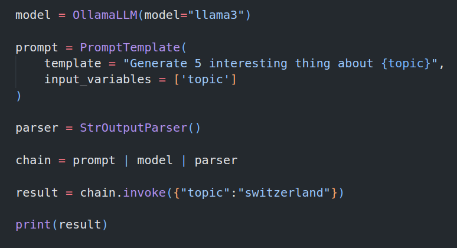

# GENERATIVE AI USING LANGCHAIN

### Difference between LLM and Chatmodel
| Concept              | `LLM`                                                            | `ChatModel`                                                                                   |
| -------------------- | ---------------------------------------------------------------- | --------------------------------------------------------------------------------------------- |
| **Purpose**          | Designed for **plain text input/output** (single string).        | Designed for **chat-like structured input** (messages with roles like user/system/assistant). |
| **Example Input**    | `"Explain recursion in simple words"`                            | `[HumanMessage(content="Explain recursion in simple words")]`                                 |
| **Example Output**   | `"Recursion is when a function calls itself..."`                 | `AIMessage(content="Recursion is when a function calls itself...")`                           |
| **Use Case**         | Text completion, summarization, data extraction from plain text. | Conversational agents, multi-turn chat, context-aware dialogue.                               |
| **Underlying Model** | Can wrap models like `text-davinci-003`, `llama-3-text`, etc.    | Wraps chat models like `gpt-3.5-turbo`, `gpt-4o`, `llama-3-8b-chat`, etc.                     |


## 3. Chains in LangChain
1. **Chains:** 
   A chain is basically a pipeline of components in LangChain where the output of one component is passed as input to the next.
    ```nginx
    Prompt → Model → Parser
    ```
    So, you can think of a Chain as:
   - Input → [Sequence of steps] → Output

2. **Chain Definition:**
    ```nginx
        chain = prompt | model | parser
    ```
    The | operator means “pipe the output into the next component.”
    
    ```lua
        +-------------+       
        | PromptInput |       
        +-------------+       
                *              
                *              
                *              
        +----------------+     
        | PromptTemplate |     
        +----------------+     
                *              
                *              
                *              
          +-----------+        
          | OllamaLLM |        
          +-----------+        
                *              
                *              
                *              
       +-----------------+     
       | StrOutputParser |     
       +-----------------+     
                *              
                *              
                *              
     +-----------------------+  
     | StrOutputParserOutput |  
     +-----------------------+ 
    ```


## Tools in langchain
- **A tool** = a Python function wrapped so that the LLM can call it during reasoning.
- **LangChain tools** = a bridge that allows LLMs to interact with the outside world.

### AI agents vs LLMs
take an example that user has asked for current stock price of apollo tyres.
1. **LLM:** 
    - A normal LLM cannot fetch live stock prices.
    - It will just guess based on old training data.

2. **Agent** can decide that:
    - This requires real-time data
    - It should call a stock price API tool
    - It fetches the current Apollo Tyres price
    - And returns the actual live value to you

So the agent does:
- Understand your request
- Realise it needs external data
- Choose the right tool
- Call the API
- Use the response
- Give you the fresh answer
- LLM alone cannot do those steps.


### 1. Tool Creation
Tool creation is the process of defining a function that performs a specific task and exposing it as a callable tool for the LLM.
```python
from langchain.tools import tool

@tool
def add(a: int, b: int) -> int:
    return a + b
```

### 2. Tool Binding
Tool binding is attaching tools to an LLM so that the model knows which tools are available for use.
```python
from langchain_openai import ChatOpenAI

llm = ChatOpenAI(model="gpt-4o-mini").bind_tools([add])
```

### 3. Tool Calling
Tool calling happens when the LLM decides that using a tool is necessary and it returns a structured request describing which tool to call and with what parameters.
```json
{
  "tool": "add",
  "arguments": {"a": 5, "b": 7}
}
```

### 4. Tool Execution
Tool execution is the actual running of the tool’s Python function using the arguments produced by the model, returning a final result to the LLM.
```python
result = add.invoke({"a": 5, "b": 7})  # returns 12
```
